#PART 1. HYPERVISORS
####1. What are the most popular hypervisors for infrastructure virtualization?

The most popular hypervisors are:

1. VMware vSphere Hypervisor
2. Microsoft Hyper-V
3. Citrix XenServer
4. Oracle VirtualBox
5. Red Hat Enterprise Virtualization Hypervisor (REVH)
6. KVM
7. Parallels
8. Qemu

Visual comparison:
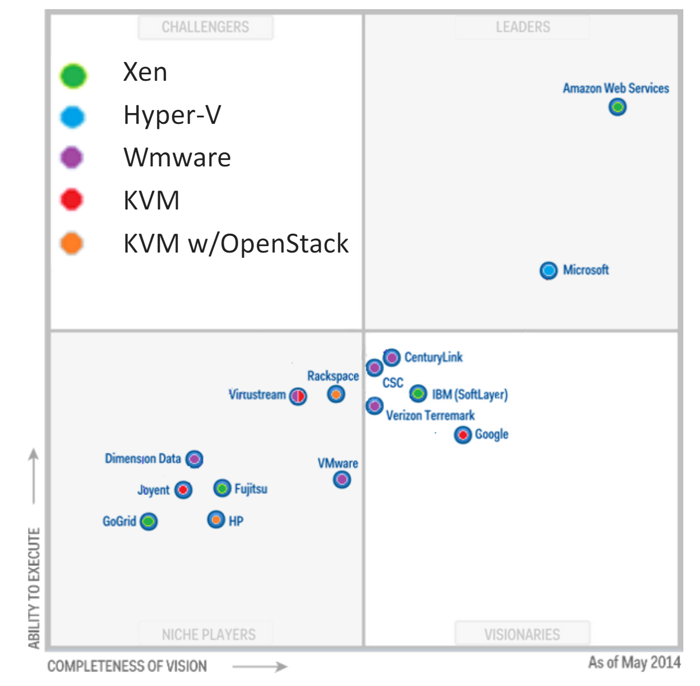

####2. Briefly describe the main differences of the most popular hypervisors.

######Hypervisor, Type 1

It runs as a control program directly on the hardware side of the computer.
Virtual machine operating systems run higher

_(Microsoft Hyper-V.VMware ESX Server.Citrix XenServer)_

Guest OS believe that they are working directly on the **hardware platform**, they do not see the hypervisor
- OS not changed
- better performance

**Choice for data centers**
- Consolidation of several operating systems and programs for a smaller number of HW
- Move guests between systems to balance performance
- Snapshots and cloning

**Creating and managing guest operating systems**
- Can be run in kernel mode
- You can implement device drivers
- Other traditional OS resources (such as services) such as CPU and memory management are also provided

######Hypervisor, Type 2

It runs on the host operating system.
Guest virtual machine operating systems are at a higher level

_(VMware Workstation, Oracle VM VirtualBox, Microsoft Virtual PC, Parallels Desktop)_

######Hypervisor, Types 3, 4

The **monolithic** hypervisor includes hardware device drivers (hardware virtualization).

**Microkernel**.
In this case, device drivers are located inside the host operating system.
In this case, the host operating system, like guest, runs in a virtual environment and is called the "parent".
Only the parent operating system has access to the hardware, the daughter ones, in turn,
can interact with the hardware only through the "parent".

#PART 2. WORK WITH VIRTUALBOX

As a report I will provide screenshots with descriptions below.

####1. First run VirtualBox and Virtual Machine (VM).

Here You can see descriptions of my VMs.

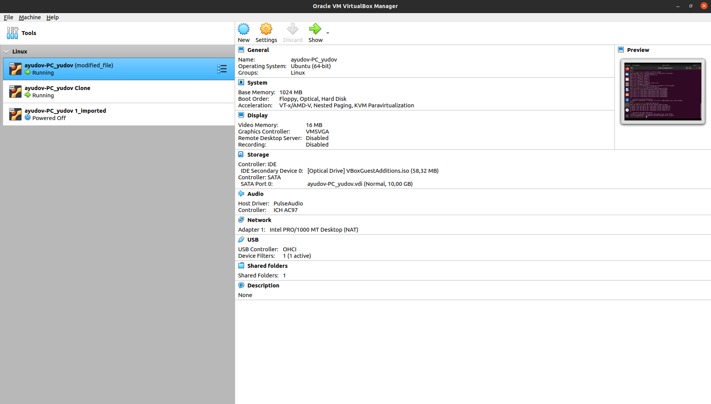
_ayudov-PC_yudov_ (VM1, original)

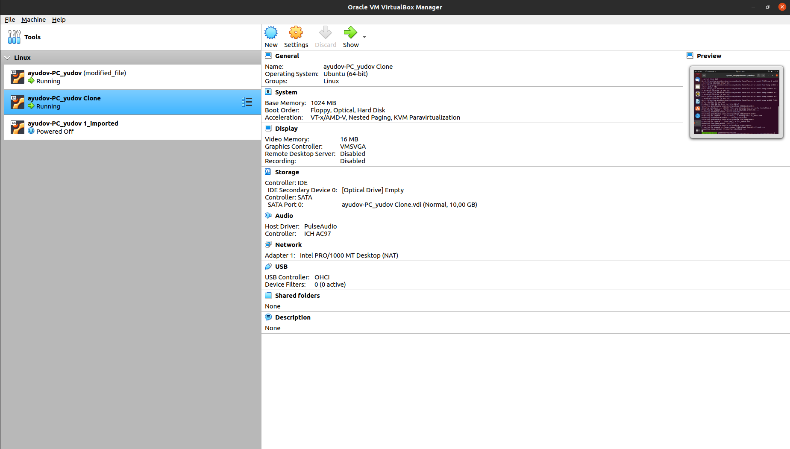
_ayudov-PC_yudov Clone_ (VM2, cloned)

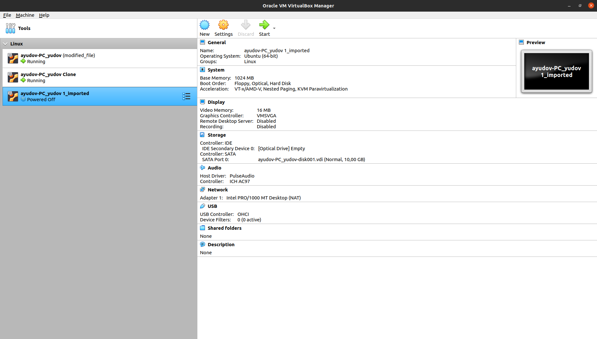
_ayudov-PC_yudov_imported_ (VM3, imported)

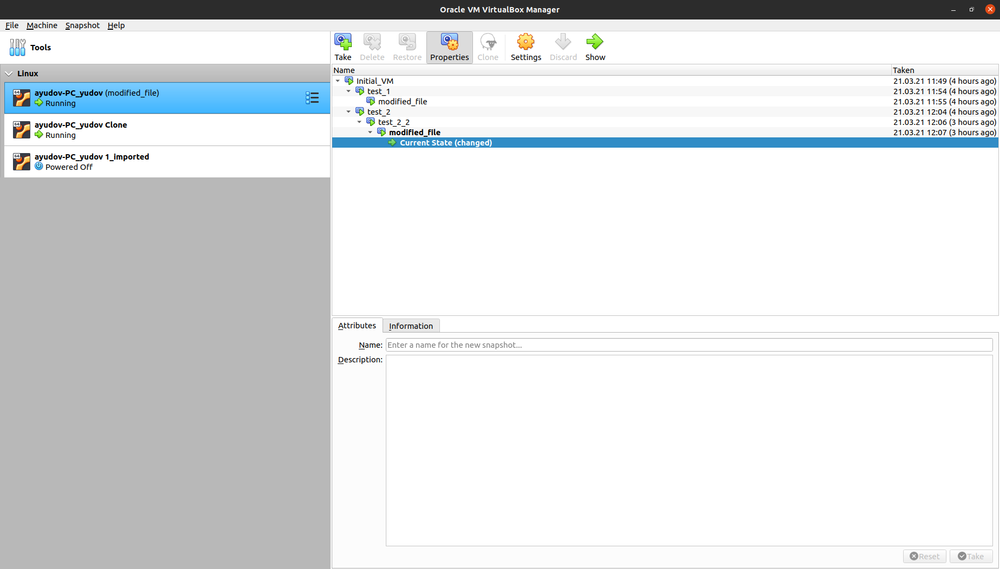
_Snapshot's tree of VM1_

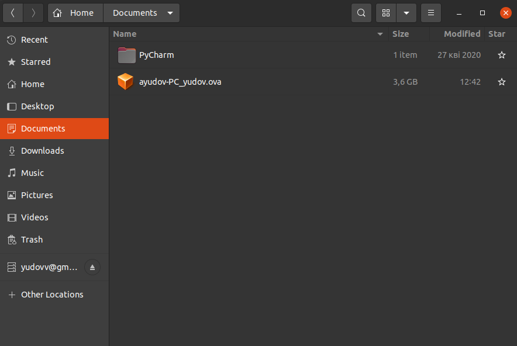
_Exported VM1_

####2. Configuration of virtual machines.

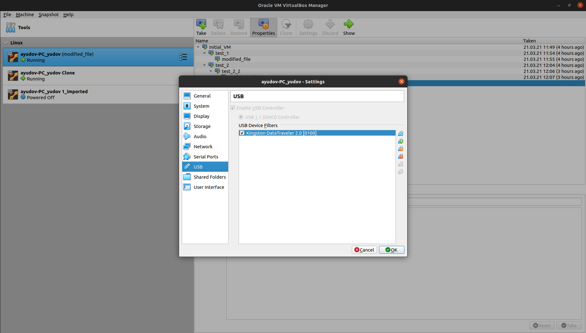
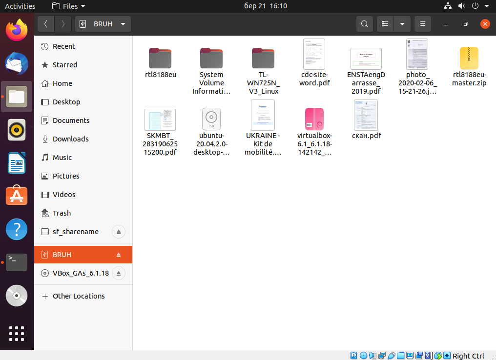
_Mounted USB flash drive on VM1_

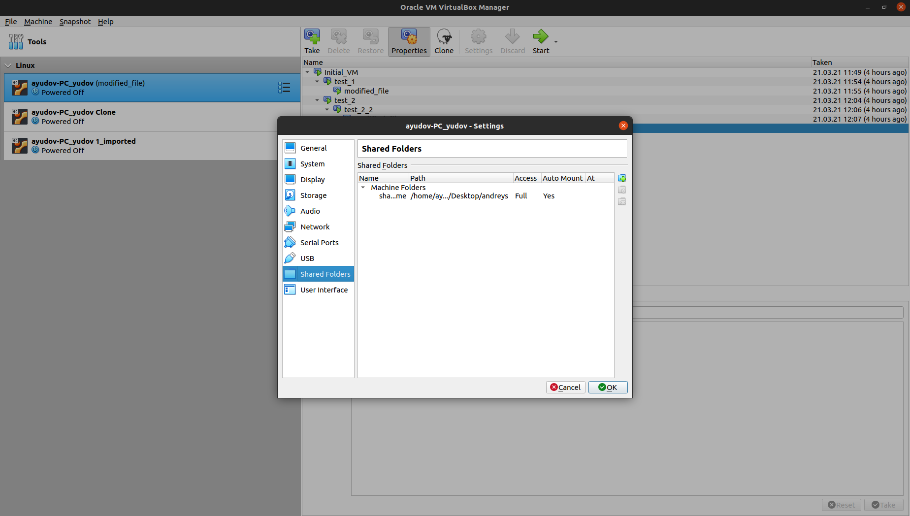
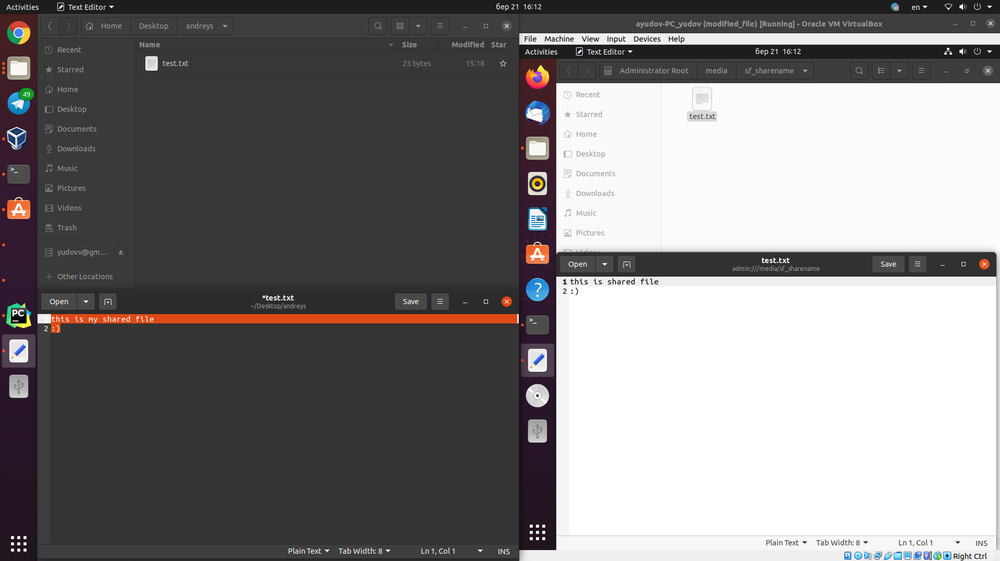
_Shared folder Host -> VM1_

Table of possible connections:

| Mode       | VM→Host | VM←Host | VM1←→VM2 | VM→Net&LAN | VM←Net&LAN |
| :--------: | :-----: | :------:| :-----: | :--------: | :--------: |
| Host-only  | + | + | + | - | - |
| Bridged    | + | + | + | + | + |
| Internal   | - | - | + | - | - |
| NATservice | + | + | + | + | + |
| NAT        | + | + | - | + | + |

#PART 3. WORK WITH VAGRANT

For part 3 I've followed steps, described in this part:

Created env with default Vagrant box hashicop/precise64. _vagran up_ -ed it.

_Date_

After that I've stopped and deleted VM.

For creating my own VM, I have used VM1 from part 2.

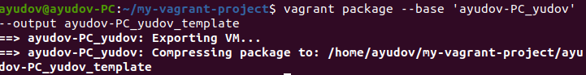

_Packaging box_

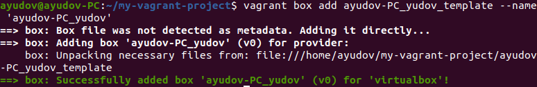

_Adding box_
