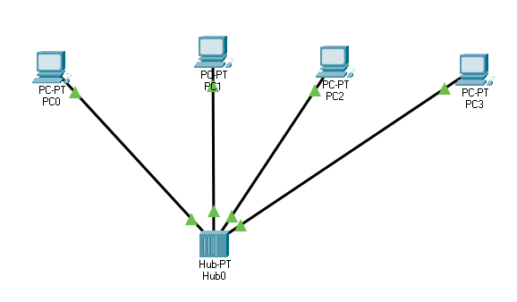

# Networking Fundamentals

### First topology

_Network_

_Event list_

https://user-images.githubusercontent.com/22365001/113121112-f872a500-921a-11eb-86db-0f79e9e92a96.mp4

_Video of packet transferring with IPs_

After deleting IPs, the error occurs when trying to transfer files.

### Topology 2
https://user-images.githubusercontent.com/22365001/113144069-89567a00-9235-11eb-91ed-3786fecc9ca3.mp4

_Video of packet transferring with IPs_

### Topology 3

https://user-images.githubusercontent.com/22365001/113144273-bc007280-9235-11eb-977c-a225b26f82d6.mp4

_Video of packet transferring with IPs_

When dealing with switch, it helps to avoid unnecessary load on system,
while check correct IP address. Main feature of switch it's that he knows
IP addresses of connected devices, that allows him to send the packet
directly to receiver.

### Topology 4
https://user-images.githubusercontent.com/22365001/113144401-dcc8c800-9235-11eb-8d7b-892843ab4d2c.mp4

_Video of packet transferring with IPs_

### Topology 5

https://user-images.githubusercontent.com/22365001/113144490-f702a600-9235-11eb-84cb-b953c1c6724d.mp4

_Video of packet transferring with IPs_

Topology 5 helps to connect different subnetworks one with another.
This allows to create bigger networks with different IPs.
It can be possible due to table of routing stored in router.

